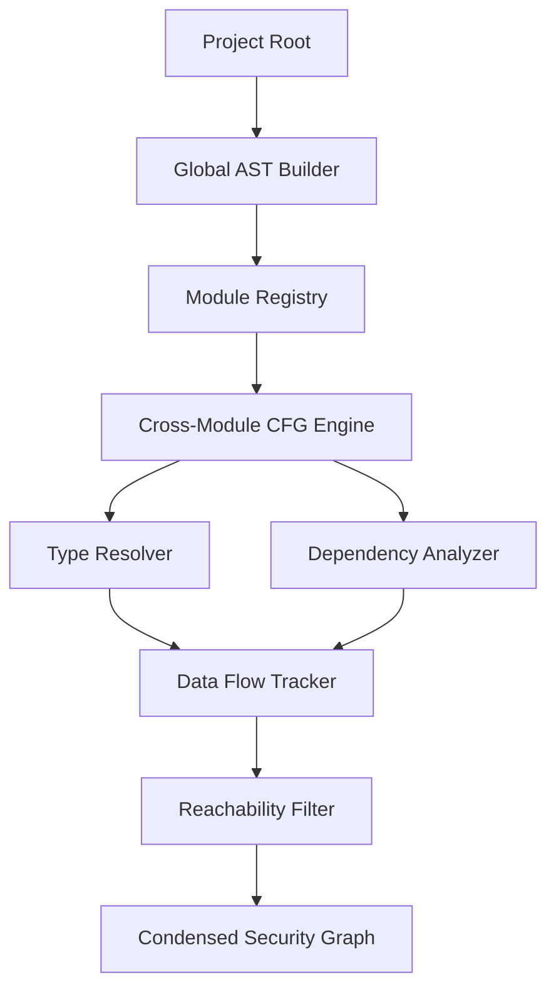

# Design: Cross-Module Code Representation Engine

## Overview

The Cross-Module Code Representation Engine employs a Global AST structure that abstracts file boundaries into a unified Graph representation. It utilizes a layered approach where syntax trees are processed into Control Flow Graphs (CFG), which are then enriched with type information and dependency data. The core usecase involves a recursive taint-tracking algorithm that follows data flows across module boundaries, leveraging type hints for precision and automated pruning to discard unreachable code paths, ensuring only exploitable security risks are presented.

## Architecture

## Design Decisions

### Large Project AST Management

**Choice:** Incremental Build of Graph Database

**Rationale:** Allows horizontal scaling for very large repositories and ensures memory limits aren't exceeded during cross-module analysis.

**Options Considered:** In-memory recursive trees, Graph database storage (Neo4j), Incremental build on disk

### Reachability Analysis Algorithm落

**Choice:** Demand-driven Taint Analysis

**Rationale:** Prioritizes performance by only calculating reachability for identified security sinks.

**Options Considered:** Full exhaustive path exploration, Demand-driven taint analysis

## Components

### Global AST Manager (domain)

**File:** `domain/ast_manager.py`

**Responsibilities:**
- Maintaining unified node IDs across file boundaries
- Aggregating syntax trees from various modules

### Cross-Module Data Flow Engine (usecases)

**File:** `usecases/data_flow_engine.py`

**Responsibilities:**
- Resolving call sites to remote module definitions
- Propagating taint labels across function boundaries

### Dependency Integration Adapter (adapters)

**File:** `adapters/dependency_resolver.py`

**Responsibilities:**
- Parsing lockfiles for version detection
- Mapping library calls to known source/sink patterns

## Correctness Properties

- **F0a-P1: Cross-Boundary Integrity** — `For any identified data flow path, if the path involves a cross-module transition without a valid call-return link, the path must be pruned from the output graph.`
- **F0a-P2: Type-Hint Priority** — `For any user-defined type annotation, the Engine must prioritize the developer-provided hint over heuristic inference during CFG construction.`

## Error Scenarios

| Scenario | Exception | Handling |
|----------|-----------|----------|
| Two modules import each other leading to infinite graph traversal. | CircularDependencyError | Detect cycle and break traversal after one full pass, marking nodes as 'partially resolved' to prevent infinite loops. |

## Testing Strategy

The strategy includes multi-file integration tests using mock repositories to verify cross-module data flow persistence. Unit tests will target the Type Resolver with various edge-case annotations. Performance benchmarking will measure memory consumption during Global AST construction for projects with >1000 modules.
