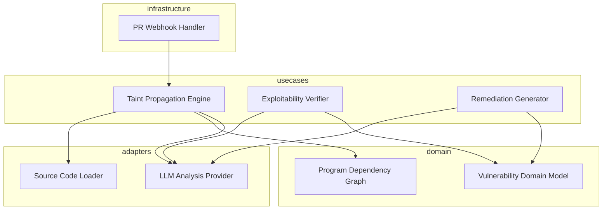

# Design: Deep-Context Taint Tracker

## Overview

The Deep-Context Taint Tracker follows a clean architecture where the core logic revolves around a Program Dependency Graph (PDG) that tracks data flow from sources to sinks. It leverages a hybrid approach: static analysis constructs the initial candidate paths, which are then passed to an LLM-based adapter for exploitability verification and automated remediation. This ensures that the high-computational cost of LLMs is only applied to high-probability vulnerabilities, meeting both performance and accuracy requirements for CI/CD integration.

## Architecture

## Design Decisions

### Analysis Engine Strategy

**Choice:** Graph-augmented LLM Chain

**Rationale:** Static analysis struggles with cross-file context, while pure LLM cannot ingest an entire repo. A Program Dependency Graph narrows the context for the LLM.

**Options Considered:** Pure Static Analysis (Grepping/Regex), Pure LLM (Context window limited), Graph-augmented LLM Chain

### Sanitizer Recognition Mechanism

**Choice:** Heuristic + LLM Sanitizer Detection

**Rationale:** Combining heuristics for known libraries with LLM semantic reasoning for custom internal sanitizers ensures high precision and low false positives (1.5).

**Options Considered:** Hardcoded library lists, LLM-based semantic analysis, Heuristic + LLM Sanitizer Detection

## Components

### TaintPropagationEngine (usecases)

**File:** `src/usecases/taint_engine.py`

**Responsibilities:**
- Traverse cross-file call graphs
- Track data flow from user inputs to sensitive sinks
- Identify missing or insufficient sanitization steps

### ExploitabilityVerifier (usecases)

**File:** `src/usecases/exploit_verifier.py`

**Responsibilities:**
- Evaluate environmental constraints against found paths
- Filter false positives from sanitizer logic
- Assign severity based on reachability context

## Correctness Properties

- **F0b-P1: Exploitation Reachability Guarantee** — `For any detected taint path labeled as 'Critical', the Exploitability Verifier must have confirmed a viable data flow from a controlled source (1.1) to an un-sanitized sink (1.5) without hitting any recognized sanitizers (1.2).`

## Error Scenarios

| Scenario | Exception | Handling |
|----------|-----------|----------|
| The cross-file call graph for a specific taint path exceeds the LLM maximum token limit. | ContextWindowExceededError | The system automatically breaks the call graph into smaller logical clusters and performs iterative analysis to maintain precision. |

## Testing Strategy

The testing strategy includes unit tests for the PDG construction (domain layer), integration tests using a 'vulnerable-by-design' multi-file project to verify path discovery (usecases), and golden-set benchmark tests to evaluate the LLM's remediation accuracy against known SQLi samples. Coverage will focus on sanitizer recognition to prevent regression on false positive filtering.
