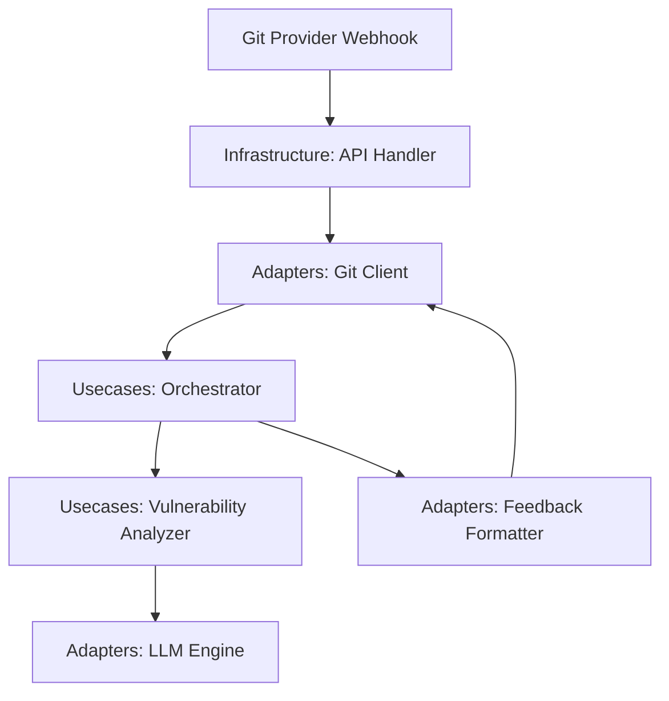

# Design: CI/CD Orchestration Layer

## Overview

The CI/CD Orchestration Layer (F0c) follows a Clean Architecture approach to bridge Git provider events with AI-driven security analysis. It utilizes a webhook-driven logic flows to intercept Pull Request submissions, process them through high-fidelity reachability filters, and deliver actionable remediation patches directly into the developer's review UI. By decoupling the core orchestration logic from specific Git providers via adapters, the system ensures extensibility while maintaining the 15-minute remediation SLA through event-driven processing and LLM-powered fix generation.

## Architecture

## Design Decisions

### How to trigger code analysis tasks?

**Choice:** Webhook-based Event Driven Architecture

**Rationale:** Minimizes latency to meet the 15-minute remediation threshold and reduces unnecessary API overhead.

**Options Considered:** Polling Git API, Webhook-based Event Driven Architecture

### How to handle multiple Git hosting services?

**Choice:** Adapter pattern for Git providers

**Rationale:** Allows the system to support GitHub, GitLab, and Bitbucket using a unified interface (F0c.4).

**Options Considered:** Provider-specific hardcoding, Adapter pattern for Git providers

## Components

### ScanOrchestrator (usecases)

**File:** `src/usecases/orchestrator.py`

**Responsibilities:**
- Trigger code analysis based on PR metadata
- Coordinate between vulnerability analysis and feedback formatting
- Update PR status on Git provider

### GitAdapter (adapters)

**File:** `src/adapters/git_client.py`

**Responsibilities:**
- Authorize via OAuth/PAT tokens
- Download PR diffs/files
- Submit rich-text comments to PR threads

## Correctness Properties

- **F0c-P1: Feedback Completeness** — `For any SQL injection vulnerability detected, the bot must provide a contextual explanation and a code fix within the PR comment.`

## Error Scenarios

| Scenario | Exception | Handling |
|----------|-----------|----------|
| The bot exceeds Git provider API rate limits during high PR volume. | RateLimitExceededException | Implement an exponential backoff retry mechanism with a jitter for Git API calls. |

## Testing Strategy

The strategy includes unit tests for Orchestrator logic using mocked adapters, integration tests verifying the full Git-to-LLM flow using wire-mocked API responses, and reachability accuracy tests for SQL injection detection. Coverage will target 90% for usecases and adapters.
