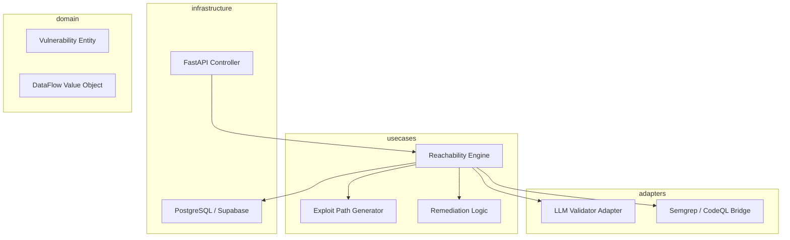

# Design: Automated Exploitability Verification

## Overview

The Automated Exploitability Verification system follows a Clean Architecture approach where the Use Case layer coordinates between external static analysis tools and LLM reasoning providers to validate vulnerability reachability. It uses a data-flow centric domain model that tracks untrusted input from source to sink across module boundaries. By combining traditional taint tracking with LLM-based logical verification, the system filters out non-exploitable paths and generates precise remediation diffs, satisfying requirements for high-fidelity reporting and rapid developer turnaround.

## Architecture

## Design Decisions

### Verification Methodology

**Choice:** Taint analysis with LLM validation logic checks

**Rationale:** SAST alone results in high false positives (1.1), while DAST is too slow and resource-heavy for 15-minute remediation (1.3). LLMs can bridge the 'logical gap' in complex data paths.

**Options Considered:** Pure Static Analysis (SAST), Dynamic Execution (DAST) in Sandboxes, Hybrid Static Analysis + LLM logical verification

### Data Path Storage Strategy

**Choice:** Relational persistence with detailed path JSON schemas

**Rationale:** Relational storage allows for audit queries required by 1.4 while JSONB provides flexibility for varying depth in data paths for 1.2.

**Options Considered:** Raw log files, Graph Database, Relational Database with JSONB fields

## Components

### ReachabilityEngine (usecases)

**File:** `src/usecases/reachability_engine.py`

**Responsibilities:**
- Orchestrating the data flow analysis across multiple modules
- Triggers LLM validation for complex logic gates
- Determines exploitability status

### LLMValidatorAdapter (adapters)

**File:** `src/adapters/llm_provider.py`

**Responsibilities:**
- Transforming code snippets into LLM prompts
- Parsing LLM output into Remediation objects
- Validating path logic using chain-of-thought reasoners

## Correctness Properties

- **F1-P1: Auditability of Suppressed Alerts** — `For any vulnerability marked as 'Suppressed', the system must provide a machine-readable data path audit log showing why the reachability sink was not triggered.`
- **F1-P2: Remediation Accuracy** — `For any vulnerability provided to a developer, the remediation code fix must compile and address the specific taint sink identified in the data path.`

## Error Scenarios

| Scenario | Exception | Handling |
|----------|-----------|----------|
| Analyzing extremely long data flows across dozens of files. | ContextWindowExceededError | If the code path is too large for a single LLM prompt, the service breaks the path into segments and performs 'hop-by-hop' reachability verification. |

## Testing Strategy

The strategy involves Unit Tests for the domain objects, Integration Tests for the Semgrep/LLM adapters using Mock responses, and end-to-end (E2E) Regression Tests using a vulnerable-by-design 'Juice Shop' style repository to ensure the Reachability Engine correctly identifies known exploitable vs. non-exploitable paths. Coverage will focus on the Use Case layer to ensure 100% path logic coverage for suppressions.
