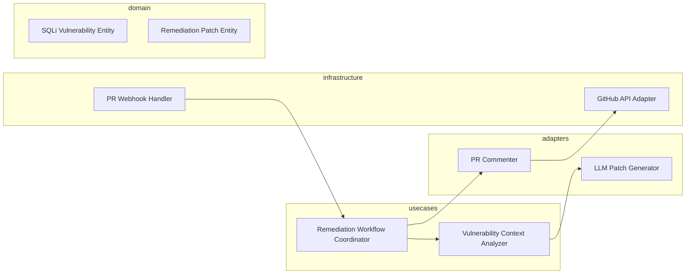

# Design: Context-Aware SQLi Remediation

## Overview

The Context-Aware SQLi Remediation system uses a Clean Architecture to decouple the vulnerability analysis logic from specific CI/CD providers and LLM vendors. When a PR is analyzed, the system extracts code snippets and framework metadata (e.g., TypeORM, Hibernate) to construct a high-fidelity prompt for an LLM provider. The generated remediation includes both a secure code patch and an interactive pedagogical explanation. These are then injected directly into the developer's pull request as suggested changes to ensure a seamless workflow that meets velocity targets.

## Architecture

## Design Decisions

### Patch Generation Strategy

**Choice:** LLM-based Patch Generation with Framework context injected into System Prompts.

**Rationale:** LLMs provide the flexibility needed for context-aware explanations and diverse framework syntax (e.g., ORM vs Raw SQL) while fulfilling interactive tip requirements.

**Options Considered:** Regex-based static templates, Rule-based AST transformation, LLM-based Generation

### Remediation Delivery Mechanism

**Choice:** GitHub PR Comments with "Suggested Changes" Markdown blocks.

**Rationale:** Direct PR integration minimizes developer context switching and supports the 15-minute remediation SLA.

**Options Considered:** Email notifications, Stand-alone CLI tool, GitHub PR Comments

## Components

### RemediationOrchestrator (usecases)

**File:** `src/usecases/remediation_orchestrator.ts`

**Responsibilities:**
- Orchestrating flow between analyzer and presenter
- Ensuring 15-minute SLA targets by caching components

### LLMPatchGenerator (adapters)

**File:** `src/adapters/llm_patch_generator.ts`

**Responsibilities:**
- Constructing prompts with framework context
- Parsing LLM output into Patch entities
- Providing interactive secure coding tips

## Correctness Properties

- **F2-P1: Framework-Specific Enforcement** — `For any SQL injection vulnerability detected, the system must generate a patch that utilizes the detected framework's native parameterized query syntax.`

## Error Scenarios

| Scenario | Exception | Handling |
|----------|-----------|----------|
| The code context provided for the SQLi is too large for the LLM window. | ContextTokenLimitExceededException | Truncate codebase context to only include immediate data-flow paths and relevant ORM configuration files. |

## Testing Strategy

The strategy includes unit tests for domain models, integration tests for the GitHub API adapter using wiremock, and 'Golden Master' testing for LLM prompts to ensure consistent framework-specific output. We will measure success by the 'Time-to-Remediate' metric during staging simulations.
