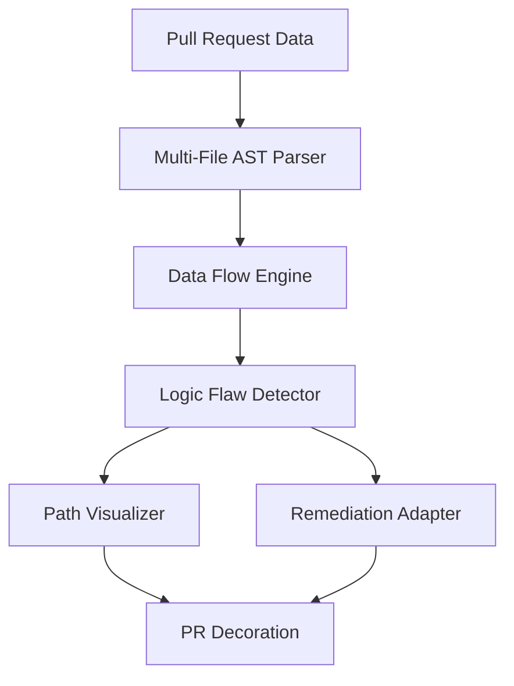

# Design: Cross-Module Logic Flaw Detection

## Overview

The design utilizes a graph-based data flow analysis engine centered in the usecases layer to trace authentication and logic states across module boundaries. By parsing multiple files into a unified Abstract Syntax Tree (AST) representation, the system can identify where a security gate in one module is bypassed by an unchecked entry point in another. The solution integrates with LLM adapters to synthesize holistic remediation suggestions and uses Mermaid-compatible path strings to visualize the vulnerability lifecycle directly within the PR interface.

## Architecture

## Design Decisions

### Mechanism for cross-module data flow tracking

**Choice:** Graph-based Representation (Directed Acyclic Graph)

**Rationale:** A DAG allows for precise tracing of data movement across complex import/export structures, which is necessary for detecting logic-gate bypasses.

**Options Considered:** Static Regex Patterns, Greedy Text Search, Graph-based Representation (Directed Acyclic Graph)

### Remediation strategy for distributed logic errors

**Choice:** Multi-Turn Prompting Context

**Rationale:** Cross-module flaws require the LLM to understand the interaction between files; providing only one file results in incomplete fixes.

**Options Considered:** Single-file patch generation, Multi-Turn Prompting Context

## Components

### CrossModuleFlowEngine (usecases)

**File:** `src/usecases/analysis/cross_module_flow.py`

**Responsibilities:**
- Trace variable state across module boundaries
- Identify authentication gate bypasses
- Generate vulnerability path graphs

### RemediationAdapter (adapters)

**File:** `src/adapters/llm/remediation_provider.py`

**Responsibilities:**
- Format multi-file context for LLM prompts
- Parse LLM output into git-diff format for PR suggestions

## Correctness Properties

- **F3-P1: Complete Multi-Module Reporting** — `For any identified logic flaw spanning multiple files, the system must generate a visual flow map as per 3.1 and provide a remediation suggestion that addresses all involved modules as per 4.1.`

## Error Scenarios

| Scenario | Exception | Handling |
|----------|-----------|----------|
| The parser encounters circular imports between modules being analyzed. | CircularDependencyException | The analyzer limits recursion depth and flags the circular dependency as a potential architectural smell in the PR feedback. |

## Testing Strategy

Testing will focus on integration tests using a suite of 'vulnerable-by-design' multi-file repositories. Coverage will include scenarios with nested imports and varied authentication patterns. Unit tests will validate the Flow Engine's ability to track variable propagation across modular interfaces without losing context.
