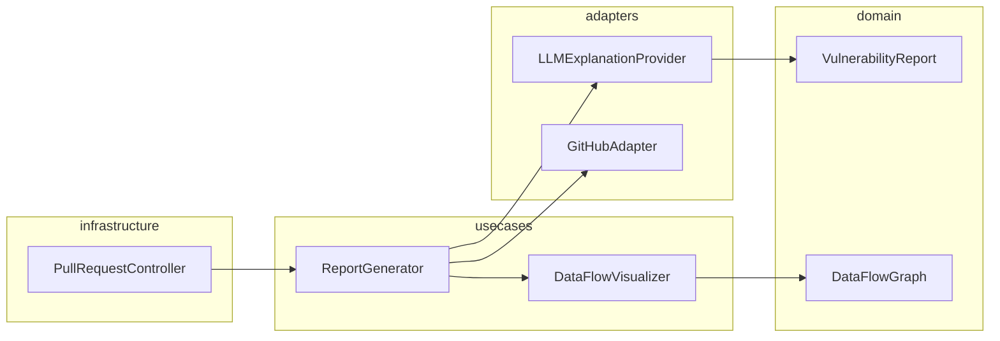

# Design: Explainable Security Reporting

## Overview

The Explainable Security Reporting system follows a Clean Architecture approach to decouple the logic of security analysis from the presentation layer on PRs. It uses an LLM-driven adapter to transform raw AST/SINK data into human-readable narratives and leverages Mermaid.js for inline data-flow visualization. The system ensures that security feedback is educational and directly integrated into the developer's existing CI/CD workflow.

## Architecture

## Design Decisions

### Method for visual data-flow mapping in PRs

**Choice:** Markdown-based Flow Visualization

**Rationale:** Mermaid.js allows for dynamic, text-based rendering directly within GitHub/GitLab PR comments without requiring external image hosting or broken links.

**Options Considered:** Static SVG generation, Mermaid.js markdown blocks, External UI links

### Strategy for generating educational guidance

**Choice:** Context-Injected Prompting

**Rationale:** Context-injected prompting allows the explanation to reference specific code lines and variables from the developer's PR, making the education more relevant.

**Options Considered:** Hardcoded templates per CWE, Context-injected LLM prompting, RAG with internal security wiki

## Components

### ReportGenerator (usecases)

**File:** `src/usecases/report_generator.py`

**Responsibilities:**
- Coordinates explanation generation and data-flow mapping
- Formats final output for Pull Request comments

### LLMExplanationProvider (adapters)

**File:** `src/adapters/llm_provider.py`

**Responsibilities:**
- Translates raw vulnerability data into natural language summaries
- Provides educational tips based on specific CWEs

## Correctness Properties

- **F4-P1: Report Completeness and Relevance** — `For any generated report pinned to a PR (4.1), the report must contain a visual data-flow mapping (2.1) and educational tips (5.1) derived from the specific vulnerability instance.`

## Error Scenarios

| Scenario | Exception | Handling |
|----------|-----------|----------|
| The data-flow graph for a complex vulnerability is too large for the LLM context window. | ContextWindowExceededError | Truncate codebase context to only include immediate data-flow paths and the relevant vulnerable function signature. |

## Testing Strategy

The strategy includes unit tests for the DataFlowVisualizer using mocked graph data, integration tests for the GitHubAdapter to ensure correct PR pinning, and LLM-response evaluation (using a 'Golden Set' of vulnerabilities) to verify the accuracy and tone of the generated remediative guidance. Coverage targets 90% for usecases and adapters.
