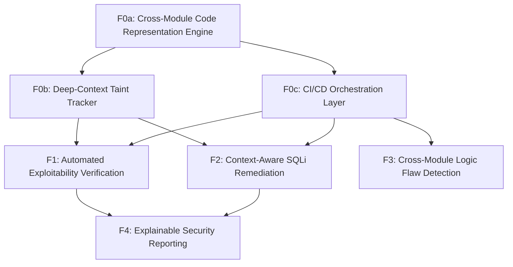

# Feature Map

## Features

| ID | Name | Type | Size | Dependencies |
|----|------|------|------|--------------|
| F0a | Cross-Module Code Representation Engine | foundation | large | — |
| F0b | Deep-Context Taint Tracker | foundation | large | F0a |
| F0c | CI/CD Orchestration Layer | foundation | medium | F0a |
| F1 | Automated Exploitability Verification | product | medium | F0b, F0c |
| F2 | Context-Aware SQLi Remediation | product | large | F0b, F0c |
| F3 | Cross-Module Logic Flaw Detection | product | large | F0c |
| F4 | Explainable Security Reporting | product | medium | F1, F2 |

## Milestones

### M0: Foundational Analysis Engine

**Goal:** Build the core analysis engine and integration hooks.

**Exit Criteria:**
- Capable of building a unified AST across a 50-file Python project
- Successful detection of a source-to-sink path across 3 modules

**Features:** F0a, F0b, F0c

### M1: High-Fidelity Remediation Launch

**Goal:** Deliver high-fidelity security insights and automated remediation to developers.

**Exit Criteria:**
- False positive rate below 5% on reachability benchmarks
- Automated code fixes for SQLi validated by unit tests

**Features:** F1, F2, F3, F4

## Dependency Graph

